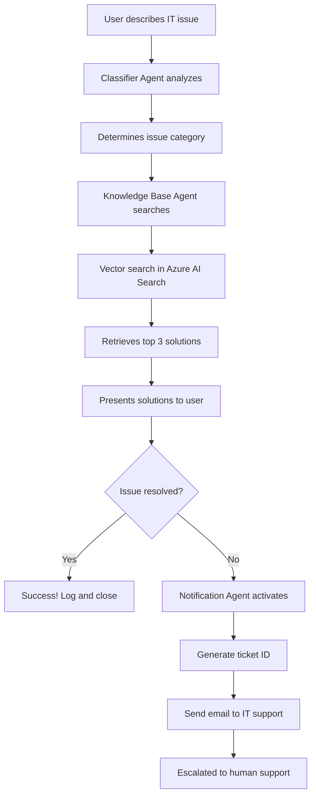

# OmniAssist AI 🤖

<div align="center">


**Intelligent IT Support Automation - Multi-Agent System Powered by Azure OpenAI & AutoGen**

[Quick Start](#-quick-start) • [Features](#-key-features) • [Documentation](docs/index.md) • [Architecture](#-architecture) • [Contributing](#-contributing)

</div>

---

## 📖 Table of Contents

- [Overview](#-overview)
- [Key Features](#-key-features)
- [Why OmniAssist AI?](#-why-helixdesk-ai)
- [Architecture](#-architecture)
- [Technology Stack](#-technology-stack)
- [Prerequisites](#-prerequisites)
- [Installation](#-installation)
- [Configuration](#-configuration)
- [Usage](#-usage)
- [Project Structure](#-project-structure)
- [How It Works](#-how-it-works)
- [Documentation](#-documentation)
- [Contributing](#-contributing)
- [License](#-license)
- [Contact](#-contact)

---

## 🌟 Overview

**OmniAssist AI** (also known as **SupportX AI Assist**) is an intelligent IT support automation system that leverages artificial intelligence and multiple specialized AI agents working in harmony to automatically resolve IT support tickets. Built with Azure OpenAI and AutoGen, it provides instant, accurate solutions to common IT issues while automatically escalating complex problems to human support.

### The Problem We Solve

Traditional IT support faces several challenges:
- 📈 **Scalability**: Ticket volume grows exponentially with company growth
- ⏰ **Slow Response**: Average ticket resolution takes 2-5 days
- 🔁 **Repetitive Work**: IT teams waste 60-70% of time on the same questions
- 🌙 **Limited Availability**: No support outside business hours
- 💰 **High Costs**: Average cost per ticket: $35

### Our Solution

OmniAssist AI addresses these challenges by:
- ⚡ **Instant Response**: 5-10 second average response time
- 🤖 **70-85% Automation**: Automatically resolves routine IT issues
- 💵 **Cost-Effective**: ~$5 per ticket (vs. $35 traditional)
- 🌐 **24/7 Availability**: Always-on support
- 📊 **Consistent Quality**: Same high-quality answer every time

---

## ✨ Key Features

### 🧠 Natural Language Understanding
Type problems in plain English—no technical jargon required. The system understands context and intent using advanced language models.

### 🤖 Multi-Agent Collaboration
Three specialized AI agents work together seamlessly:
- **Classifier Agent**: Categorizes and understands the issue type
- **Knowledge Base Agent**: Searches and retrieves relevant solutions using vector search
- **Notification Agent**: Handles escalation to human IT support when needed

### 🔍 Semantic Vector Search
Powered by Azure AI Search with 1536-dimensional embeddings for accurate solution matching. Understands meaning, not just keywords.

### 📧 Automatic Escalation
If AI can't resolve the issue, human IT is notified automatically with:
- Detailed ticket information
- Unique ticket ID
- Email notification to IT support

### ⚡ Lightning Fast
- Average response time: **5-10 seconds**
- Handles unlimited concurrent users
- Processes complex queries with multiple solution options

### 📊 High Resolution Rate
Automatically resolves **70-85%** of routine IT issues, freeing IT teams to focus on complex problems and strategic initiatives.

---

## 💡 Why OmniAssist AI?

### Business Impact

For a company with **500 employees**:

| Metric | Traditional IT | With OmniAssist AI | Improvement |
|--------|----------------|-------------------|-------------|
| **Monthly Tickets** | 1,000 | 1,000 | - |
| **Auto-Resolved** | 0 | 700 (70%) | +700 |
| **Response Time** | 2-5 days | 5-10 seconds | **99.9% faster** |
| **Monthly Cost** | $35,000 | $14,500 | **59% reduction** |
| **Annual Savings** | - | **$252,000** | - |

**ROI: 1,697% in Year 1** 🚀

### Benefits by Stakeholder

#### 👥 For Employees (End Users)
- ✅ Instant help (5-second responses vs. 2-day waits)
- ✅ 24/7 availability (no more waiting for business hours)
- ✅ Self-service empowerment
- ✅ Clear, step-by-step solutions
- ✅ Back to work in minutes, not days

#### 🛠️ For IT Teams
- ✅ 70% ticket volume reduction
- ✅ Focus on strategic work (infrastructure, security, projects)
- ✅ Lower burnout from repetitive questions
- ✅ Better visibility with automated logging
- ✅ Scalability without additional hiring

#### 🏢 For Companies
- ✅ Significant cost savings ($15-30 per automated ticket)
- ✅ Higher employee satisfaction and NPS scores
- ✅ Consistent, compliant solutions
- ✅ Knowledge retention (solutions don't leave with employees)
- ✅ Data insights to identify systemic issues

---

## 🏗️ Architecture

OmniAssist AI uses a **multi-agent architecture** where specialized AI agents collaborate to resolve tickets:

```
┌─────────────────────────────────────────────────────────────┐
│                         User Interface                       │
│                    (Streamlit Web App)                       │
└─────────────────────┬───────────────────────────────────────┘
                      │
                      ▼
┌─────────────────────────────────────────────────────────────┐
│                    Group Chat Manager                        │
│                  (AutoGen Orchestration)                     │
└─────────────────────┬───────────────────────────────────────┘
                      │
        ┌─────────────┼─────────────┐
        ▼             ▼             ▼
┌───────────┐  ┌─────────────┐  ┌──────────────┐
│Classifier │  │ Knowledge   │  │ Notification │
│  Agent    │  │ Base Agent  │  │    Agent     │
└─────┬─────┘  └──────┬──────┘  └──────┬───────┘
      │               │                 │
      │               ▼                 │
      │     ┌──────────────────┐        │
      │     │  Azure AI Search │        │
      │     │  (Vector Search) │        │
      │     └──────────────────┘        │
      │                                 │
      └─────────────┬───────────────────┘
                    ▼
          ┌──────────────────┐
          │  Azure OpenAI    │
          │    (GPT-4)       │
          └──────────────────┘
```

### Agent Responsibilities

1. **Classifier Agent** 🎯
   - Analyzes and categorizes incoming IT issues
   - Determines issue type and urgency
   - Routes to appropriate solution pathway

2. **Knowledge Base Agent** 📚
   - Performs semantic vector search on solution database
   - Retrieves top 3 most relevant solutions
   - Provides detailed, step-by-step instructions

3. **Notification Agent** 📧
   - Handles escalation for unresolved issues
   - Generates ticket IDs
   - Sends notifications to IT support team

---

## 🛠️ Technology Stack

### Core Technologies

| Technology | Version | Purpose |
|------------|---------|---------|
| **Python** | 3.13 | Core programming language |
| **Azure OpenAI** | Latest | GPT-4 for agent reasoning and NLP |
| **AutoGen** | 0.9.7 | Multi-agent orchestration framework |
| **Streamlit** | 1.47.1 | Web application framework |
| **Azure AI Search** | 11.5.3 | Vector search and indexing |

### Key Libraries

- `ag2==0.9.7` - AutoGen v2 for agent framework
- `azure-search-documents==11.5.3` - Azure search integration
- `openai==1.97.1` - OpenAI API client
- `python-dotenv==1.1.1` - Environment configuration
- `pandas==2.3.1` - Data manipulation
- `tiktoken==0.9.0` - Token counting for GPT models

---

## 📋 Prerequisites

Before you begin, ensure you have:

### Required
- ✅ Python 3.13 or higher
- ✅ Azure subscription (for OpenAI and AI Search)
- ✅ Git (for cloning the repository)

### Azure Resources Required
- ✅ **Azure OpenAI Service** with GPT-4 deployment
- ✅ **Azure AI Search** service (for vector search)
- ✅ API keys and endpoints for both services

### Optional
- Git knowledge for version control
- Basic Python knowledge for customization
- SMTP server for email notifications (Gmail, SendGrid, etc.)

---

## 🚀 Installation

### 1. Clone the Repository

```bash
git clone https://github.com/Arbiter09/OmniAssist-AI.git
cd OmniAssist-AI
```

### 2. Create Virtual Environment

```bash
# Create virtual environment
python -m venv venv

# Activate virtual environment
# On Windows:
venv\Scripts\activate

# On macOS/Linux:
source venv/bin/activate
```

### 3. Install Dependencies

```bash
pip install -r requirements.txt
```

### 4. Set Up Azure Resources

Follow the detailed [Azure Setup Guide](docs/setup/azure-setup.md) to:
1. Create Azure OpenAI resource
2. Deploy GPT-4 model
3. Create Azure AI Search service
4. Set up vector index

### 5. Configure Environment Variables

Create a `.env` file in the root directory:

```bash
# Azure OpenAI Configuration
AZURE_OPENAI_API_KEY=your_azure_openai_api_key
AZURE_OPENAI_ENDPOINT=https://your-resource.openai.azure.com/
AZURE_OPENAI_DEPLOYMENT_NAME=your_gpt4_deployment_name
AZURE_OPENAI_API_VERSION=2024-02-15-preview

# Azure AI Search Configuration
AZURE_SEARCH_ENDPOINT=https://your-search-service.search.windows.net
AZURE_SEARCH_API_KEY=your_search_api_key
AZURE_SEARCH_INDEX_NAME=your_index_name

# Email Configuration (Optional - for notifications)
SMTP_SERVER=smtp.gmail.com
SMTP_PORT=587
SMTP_USERNAME=your_email@gmail.com
SMTP_PASSWORD=your_app_password
IT_SUPPORT_EMAIL=it-support@your-company.com
```

### 6. Prepare Knowledge Base

```bash
# Create and upload search index
python create_and_upload_index.py
```

This script:
- Reads solutions from `data/knowledge_base.json`
- Generates vector embeddings
- Uploads to Azure AI Search

---

## ⚙️ Configuration

### Knowledge Base Customization

Edit `data/knowledge_base.json` to add your organization's IT solutions:

```json
{
  "solutions": [
    {
      "issue": "Outlook won't open or crashes",
      "category": "Email",
      "solution": "1. Close Outlook completely\n2. Press Win+R and type 'outlook.exe /safe'\n3. If it opens, disable add-ins...",
      "keywords": ["outlook", "email", "crash", "won't open"]
    }
  ]
}
```

### Agent Customization

Modify agent behavior in:
- `agents/classifier_agent.py` - Issue classification logic
- `agents/knowledge_base_agent.py` - Search and retrieval
- `agents/notification_agnet.py` - Escalation handling

### UI Customization

Customize the look and feel:
- `style.css` - Main stylesheet
- `app.py` - Streamlit UI configuration

---

## 📱 Usage

### Starting the Application

```bash
streamlit run app.py
```

The application will open in your default browser at `http://localhost:8501`

### Using the Interface

1. **Describe Your Issue**
   - Type your IT problem in plain English
   - No technical jargon required
   - Be as specific as possible

2. **Click "Resolve Now"**
   - AI agents analyze your issue
   - Multiple agents collaborate to find solutions
   - Response typically arrives in 5-10 seconds

3. **Review Solutions**
   - Read the provided solution steps
   - Try the suggested fixes
   - Follow step-by-step instructions

4. **Provide Feedback**
   - ✅ Click "Yes, issue resolved" if problem is fixed
   - ❌ Click "No, not helpful" to escalate to IT support

5. **Escalation (if needed)**
   - Automatic ticket creation
   - Unique ticket ID generated
   - IT support team notified via email

### Example Queries

```
✅ Good queries:
- "My Outlook crashes every time I open it"
- "I can't connect to the company VPN from home"
- "Excel is running very slowly and freezing"
- "I forgot my Windows password"

❌ Avoid vague queries:
- "Computer broken"
- "Help"
- "Not working"
```

---

## 📁 Project Structure

```
OmniAssist-AI/
├── agents/                      # AI Agent implementations
│   ├── __init__.py
│   ├── classifier_agent.py      # Issue classification agent
│   ├── knowledge_base_agent.py  # Solution search agent
│   └── notification_agnet.py    # Escalation agent
│
├── tools/                       # Utility tools for agents
│   ├── knowledge_base_tool.py   # Vector search functionality
│   └── send_email.py           # Email notification tool
│
├── utility/                     # Configuration and helpers
│   ├── __init__.py
│   ├── llm_config.py           # LLM configuration
│   └── prompt.py               # System prompts for agents
│
├── data/                        # Knowledge base data
│   └── knowledge_base.json     # IT solutions database
│
├── docs/                        # Documentation
│   ├── index.md                # Documentation home
│   ├── getting-started/        # Getting started guides
│   ├── architecture/           # Architecture documentation
│   ├── setup/                  # Setup instructions
│   ├── customization/          # Customization guides
│   ├── user-guide/             # User guides
│   ├── technical/              # Technical documentation
│   └── troubleshooting/        # Troubleshooting guides
│
├── architecture/                # Architecture diagrams
│   └── architect.jpg           # System architecture diagram
│
├── .github/                     # GitHub configuration
│   └── workflows/              # CI/CD workflows
│
├── app.py                       # Main Streamlit application
├── group_chat.py               # Multi-agent orchestration
├── agent_test.py               # Agent testing script
├── create_and_upload_index.py  # Index creation script
├── requirements.txt            # Python dependencies
├── mkdocs.yml                  # Documentation configuration
├── style.css                   # UI styling
├── .env                        # Environment variables (create this)
├── .gitignore                  # Git ignore rules
├── LICENSE                     # MIT License
└── README.md                   # This file
```

---

## 🔄 How It Works

### Workflow Diagram



### Step-by-Step Process

1. **User Input**
   - User describes their IT issue in the Streamlit interface
   - Input is captured and passed to the group chat manager

2. **Classification**
   - Classifier Agent analyzes the issue
   - Categorizes into predefined categories (Email, Network, Software, etc.)
   - Extracts key information and context

3. **Knowledge Search**
   - Knowledge Base Agent receives classification
   - Performs semantic vector search on Azure AI Search
   - Uses 1536-dimensional embeddings for meaning-based matching
   - Retrieves top 3 most relevant solutions

4. **Solution Presentation**
   - Solutions are formatted and presented to user
   - Clear, step-by-step instructions provided
   - Multiple options given when appropriate

5. **Feedback Collection**
   - User indicates if issue is resolved
   - Positive feedback logs success
   - Negative feedback triggers escalation

6. **Escalation (if needed)**
   - Notification Agent generates unique ticket ID
   - Compiles issue details and attempted solutions
   - Sends email notification to IT support team
   - User receives ticket ID for reference

### Multi-Agent Collaboration

The system uses **AutoGen's GroupChat** for agent coordination:

```python
# Agents communicate in a structured group chat
groupchat = GroupChat(
    agents=[user, classifier, kb_agent],
    speaker_selection_method="Auto",
    allow_repeat_speaker=False,
    max_round=6
)
```

Agents take turns speaking, with the system automatically selecting the next speaker based on context and conversation flow.

---

## 📚 Documentation

Comprehensive documentation is available in the `docs/` directory:

### Getting Started
- [Overview](docs/getting-started/overview.md) - System overview and concepts
- [Quick Start](docs/getting-started/quick-start.md) - Get running in 10 minutes
- [Why OmniAssist AI?](docs/getting-started/why-helixdesk.md) - Benefits and use cases

### Setup & Installation
- [Prerequisites](docs/setup/prerequisites.md) - What you need before starting
- [Installation Guide](docs/setup/installation.md) - Step-by-step setup
- [Azure Setup](docs/setup/azure-setup.md) - Azure resource configuration
- [Configuration](docs/setup/configuration.md) - Environment configuration

### Architecture & Technical
- [Architecture Overview](docs/architecture/overview.md) - System architecture
- [Multi-Agent System](docs/architecture/multi-agent-system.md) - Agent collaboration
- [Data Flow](docs/architecture/data-flow.md) - How data flows through the system
- [Tech Stack](docs/architecture/tech-stack.md) - Technology choices

### User Guides
- [For End Users](docs/user-guide/end-users.md) - How to use the system
- [For IT Admins](docs/user-guide/it-admins.md) - Administration guide
- [For Developers](docs/user-guide/developers.md) - Development guide

### Customization
- [Adding Solutions](docs/customization/adding-solutions.md) - Expand knowledge base
- [Creating Agents](docs/customization/creating-agents.md) - Build custom agents
- [Custom Tools](docs/customization/custom-tools.md) - Add new tools
- [UI Customization](docs/customization/ui-customization.md) - Customize interface

### API & Technical Reference
- [Agents API](docs/api/agents.md) - Agent API reference
- [Tools API](docs/api/tools.md) - Tools API reference
- [Configuration API](docs/api/configuration.md) - Configuration options

### Troubleshooting
- [Common Issues](docs/troubleshooting/common-issues.md) - Solutions to common problems
- [FAQ](docs/troubleshooting/faq.md) - Frequently asked questions

### About
- [Changelog](docs/about/changelog.md) - Version history
- [License](docs/about/license.md) - MIT License details
- [Contact](docs/about/contact.md) - Get in touch

---

## 🤝 Contributing

We welcome contributions from the community! Here's how you can help:

### Ways to Contribute

1. **Report Bugs** 🐛
   - Use the [issue tracker](https://github.com/Arbiter09/OmniAssist-AI/issues)
   - Include detailed reproduction steps
   - Provide system information

2. **Suggest Features** 💡
   - Open a feature request issue
   - Describe the use case and benefits
   - Discuss implementation approach

3. **Improve Documentation** 📝
   - Fix typos or unclear sections
   - Add examples and tutorials
   - Translate documentation

4. **Submit Code** 💻
   - Fork the repository
   - Create a feature branch
   - Make your changes
   - Submit a pull request

### Development Setup

```bash
# Fork and clone your fork
git clone https://github.com/YOUR_USERNAME/OmniAssist-AI.git
cd OmniAssist-AI

# Create a feature branch
git checkout -b feature/your-feature-name

# Make changes and test
python agent_test.py

# Commit and push
git add .
git commit -m "Add: your feature description"
git push origin feature/your-feature-name

# Open a pull request on GitHub
```

### Code Style Guidelines

- Follow PEP 8 for Python code
- Use meaningful variable and function names
- Add docstrings to functions and classes
- Write comments for complex logic
- Keep functions focused and single-purpose

### Testing

```bash
# Run agent tests
python agent_test.py

# Test the web interface
streamlit run app.py
```

### Pull Request Process

1. Ensure code follows style guidelines
2. Update documentation as needed
3. Test your changes thoroughly
4. Write clear commit messages
5. Reference related issues in PR description

---

## 📄 License

This project is licensed under the **MIT License** - see the [LICENSE](LICENSE) file for details.

```
MIT License

Copyright (c) 2025 Kartik Vadhawana

Permission is hereby granted, free of charge, to any person obtaining a copy
of this software and associated documentation files (the "Software"), to deal
in the Software without restriction, including without limitation the rights
to use, copy, modify, merge, publish, distribute, sublicense, and/or sell
copies of the Software, and to permit persons to whom the Software is
furnished to do so, subject to the following conditions:

The above copyright notice and this permission notice shall be included in all
copies or substantial portions of the Software.
```

---

## 📞 Contact

### Project Maintainer

**Kartik Vadhawana**
- 📧 Email: kartikvadhwana7@gmail.com
- 🐙 GitHub: [@Arbiter09](https://github.com/Arbiter09)

### Support

- **Issues**: [GitHub Issues](https://github.com/Arbiter09/OmniAssist-AI/issues)
- **Discussions**: [GitHub Discussions](https://github.com/Arbiter09/OmniAssist-AI/discussions)
- **Documentation**: [Full Documentation](docs/index.md)

### Links

- 🌐 **Repository**: [https://github.com/Arbiter09/OmniAssist-AI](https://github.com/Arbiter09/OmniAssist-AI)
- 📖 **Documentation**: [docs/](docs/)
- 🎨 **Live Demo**: Coming soon!

---

## 🌟 Acknowledgments

This project leverages amazing open-source technologies and cloud services:

- **Microsoft Azure** - For Azure OpenAI and AI Search services
- **AutoGen** - For multi-agent orchestration framework
- **Streamlit** - For rapid web app development
- **OpenAI** - For GPT-4 language models
- **Python Community** - For excellent libraries and tools

Special thanks to all contributors and the open-source community!

---

## 🚀 Roadmap

### Current Version (v1.0)
- ✅ Multi-agent system with classifier, knowledge base, and notification agents
- ✅ Azure OpenAI integration
- ✅ Vector search with Azure AI Search
- ✅ Streamlit web interface
- ✅ Email escalation system

### Planned Features (v2.0)
- 🔄 Multi-language support (Spanish, French, German)
- 📊 Analytics dashboard for IT teams
- 🔌 Integration with ticketing systems (ServiceNow, Jira)
- 🤖 Self-learning from feedback
- 📱 Mobile app support
- 🔐 Enhanced security and compliance features
- 💬 Slack/Teams integration
- 🎯 Advanced routing and priority handling

### Future Ideas
- Voice input support
- Integration with monitoring tools
- Predictive issue detection
- Custom agent creation UI
- Multi-tenant support for MSPs

---

<div align="center">

### ⭐ Star this repo if you find it helpful!

**Built with ❤️ using Azure OpenAI, AutoGen, and Streamlit**

[Report Bug](https://github.com/Arbiter09/OmniAssist-AI/issues) • [Request Feature](https://github.com/Arbiter09/OmniAssist-AI/issues) • [Documentation](docs/index.md)

</div>

